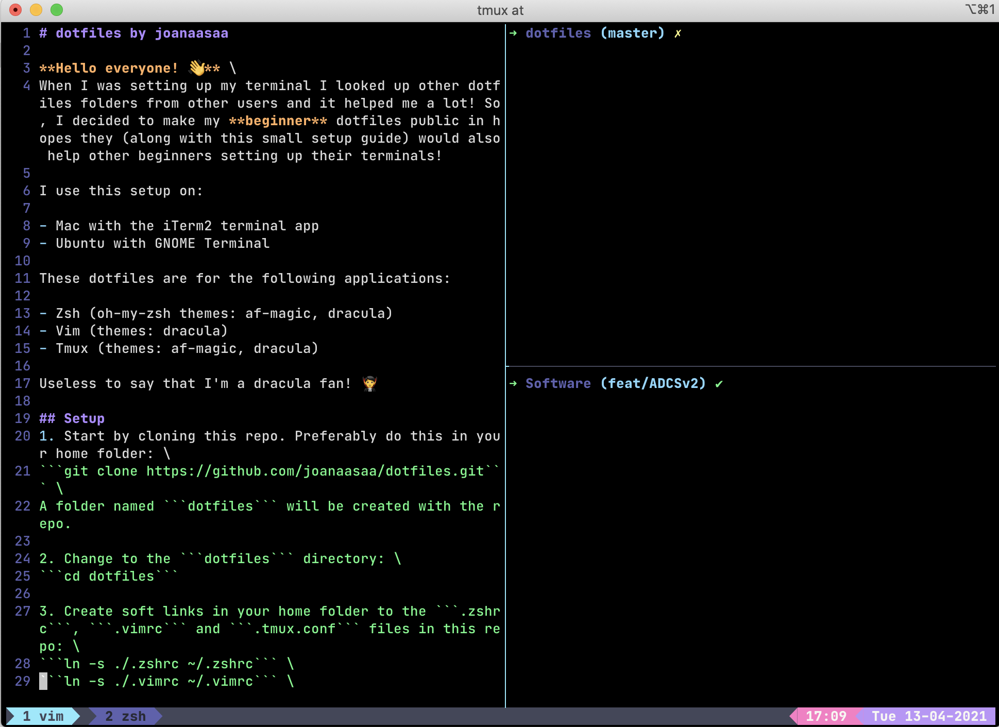

# dotfiles by joanaasaa

**Hello everyone! 👋** 

When I was setting up my terminal I looked up other dotfiles folders from other users and it helped me a lot! So, I decided to make my **beginner** dotfiles public in hopes they (along with this small setup guide) would also help other beginners setting up their terminals!

## Screenshots


**<p align="center">Dracula for Zsh, Tmux and Vim</p>**

## Environment

I use this setup on:

- Mac with the iTerm2 terminal app 
- Ubuntu with GNOME Terminal

These dotfiles are for the following applications:

- Zsh (oh-my-zsh themes: af-magic, dracula)
- Vim (themes: dracula)
- Tmux (themes: af-magic, dracula)

Useless to say that I'm a dracula fan! 🧛

## Setup
1. Start by cloning this repo. Preferably do this in your home folder: \
```git clone https://github.com/joanaasaa/dotfiles.git``` \
A folder named ```dotfiles``` will be created with the repo.

2. Change to the ```dotfiles``` directory: \
```cd dotfiles```

3. Create soft links in your home folder to the ```.zshrc```, ```.vimrc``` and ```.tmux.conf``` files in this repo: \
```ln -s ./.zshrc ~/.zshrc``` \
```ln -s ./.vimrc ~/.vimrc``` \
```ln -s ./.tmux.conf ~/.tmux.conf```

4. Choose which themes you want to use for the apps. Don't forget to install [oh-my-zsh](https://github.com/ohmyzsh/ohmyzsh) for Zsh themes:
   
   1. If you wish to use oh-my-zsh's **af-magic theme**:
      1. For zsh, open up the ```.zshrc``` file and make sure your zsh theme is set to af-magic: 
        ```ZSH_THEME="af-magic"```

      2. For tmux, I created a theme to match af-magic, based on Ham Vocke's tmux theme. You can find the original [here](https://www.hamvocke.com/blog/a-quick-and-easy-guide-to-tmux/). To use my adaptation, go to the ```.tmux.conf``` file and uncomment the code that goes in-between the following banners: \
        ```<<<<<< UNCOMMENT FROM HERE FOR AF-MAGIC THEME``` \
        ```<<<<<< UNCOMMENT TO HERE FOR AF-MAGIC THEME```

   2. If you prefer to use the **dracula theme**:
      1. For zsh, I used Zeno Rocha's theme and changed the colors slightly so they are more to my liking. For the setup I followed Zeno's "Install manually" guide from [this link](https://draculatheme.com/zsh). After doing this, if you'd like to use my color palette, copy my adaptation of Zeno's file into the correct folder: \
        ```cp ./dracula.zsh-theme ~/.oh-my-zsh/themes/```
      
      2. For tmux, I created a theme based on [cassidycodes](https://cassidy.codes/) dracula tmux theme. To use my adaptation, go to the ```.tmux.conf``` file and uncomment the code that goes in-between the following banners: \
        ```<<<<<< UNCOMMENT FROM HERE FOR DRACULA THEME``` \
        ```<<<<<< UNCOMMENT TO HERE FOR DRACULA THEME```
      
      3. For Vim ...

**<p align="center">🎉 Congratulations, you've reached the end! 🎉</p>**

## TODO
- [ ] Write setup for Vim's dracula theme
- [ ] Add screenshot for af-magic Tmux and Zsh themes