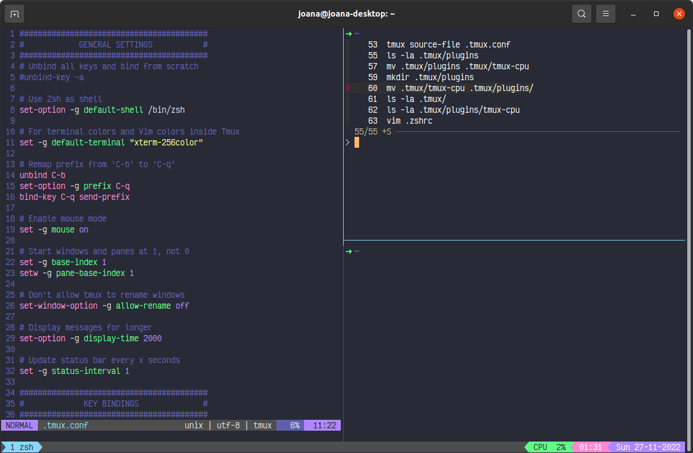

# dotfiles by joanaasaa

**
🧛 Dracula for Zsh, Tmux and Vim 🧛
**

## Environment

The repo includes Dracula themed rc files for the following apps:
- GNOME Terminal (`dracula-zsh.dconf` file)
- zsh using oh-my-zsh (`.zshrc` and `dracula.zsh-theme` file)
- vim (`.vimrc` file)
- tmux (`.tmux.conf` file)

## Features

- Includes rc files for the following apps:
    - GNOME Terminal (`dracula-zsh.dconf`)
    - zsh using oh-my-zsh (`.zshrc`)
    - vim (`.vimrc`)
- Configuration file for tmux (`.tmux.conf`)
- Syntax highlighting with Dracula colors through oh-my-zsh plugin
- Custom tmux theme with Dracula colors, datetime and CPU usage
- Altered zsh theme (through oh-my-zsh) to have official Dracula colors
- Includes simple vim configuration with lightline

## Setup

1. Clone this repo: `git clone https://github.com/joanaasaa/dotfiles.git` 

2. Either copy what interests from the zsh, vim and tmux rc files or create softlinks:\
`ln -s dotfiles/.zshrc ~/.zshrc` \
`ln -s dotfiles/.vimrc ~/.vimrc` \
`ln -s dotfiles/.tmux.conf ~/.tmux.conf`

3. For the GNOME Terminal:
    1. Install the [Viktor Mono font](https://rubjo.github.io/victor-mono/)
    2. Load the GNOME Terminal profile to your GNOME Terminal emulator: `dconf load /org/gnome/terminal/legacy/profiles:/ < dracula-zsh.dconf`
    3. Go to the terminal emulator's Preferences menu and make sure that you are using the Dracula profile.\
    _NOTE_ The profile also includes a command which uses Zsh as the startup shell when GNOME Terminal opens.

4. For Zsh:\
I used Zeno Rocha's Dracula theme (which you can find on [this](https://draculatheme.com/zsh) link) but changed the color palette to match the [official Dracula colors](https://draculatheme.com/contribute#color-palette)
    1. Download the dracula theme [this](https://github.com/dracula/zsh/archive/master.zip) zip file
    2. Unzip the downloaded zip file: `unzip zsh-master.zip`
    3. `cp zsh-master/lib/async.zsh ~/.oh-my-zsh/lib/async.zsh`
    4. To use Zeno's Dracula palette do: `cp zsh-master/lib/async.zsh ~/.oh-my-zsh/themes/lib/`\
    To use my Dracula palette do: `cp dotfiles/dracula.zsh-theme ~/.oh-my-zsh/themes/`
    5. To install the syntax highlighting: `git clone https://github.com/zsh-users/zsh-syntax-highlighting.git ${ZSH_CUSTOM:-~/.oh-my-zsh/custom}/plugins/zsh-syntax-highlighting`\
    _NOTE_ The `.zshrc` file already includes     dracula colors for the syntax highlighting plugin

5. For Vim:
    1. Install [vim-plug](https://github.com/junegunn/vim-plug): `curl -fLo ~/.vim/autoload/plug.vim --create-dirs https://raw.githubusercontent.com/junegunn/vim-plug/master/plug.vim`
    2. `vim .vimrc`
    3. Run the command `:PlugInstall` to install all Vim plugins using vim-plug

6. For Tmux:
    1. Install the tmux-cpu plugin: `git clone https://github.com/tmux-plugins/tmux-cpu ~/.tmux/plugins/tmux-cpu`
    2. Restart tour tmux server
      

**
🎉 Congratulations, you've reached the end! 🎉
**